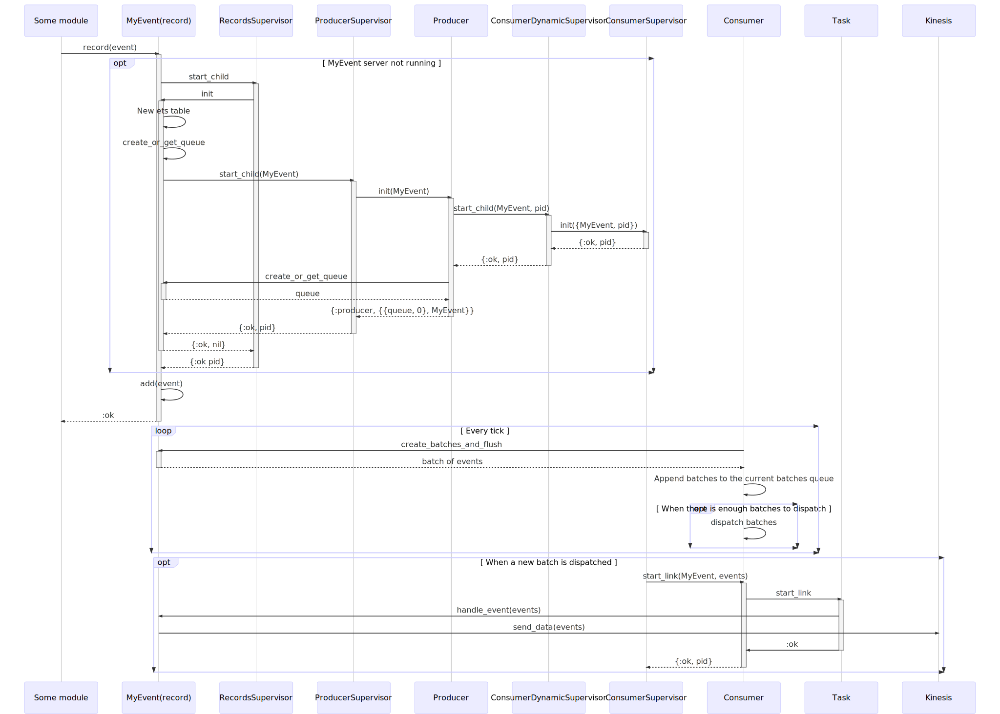

# Analytics

## History

At the beginning we were sending records to kinesis one by one.
This led to some errors and lost of events.

## Change

But Amazon Kinesis can also send events in batch which is more efficient.

Also Elixir has a *GenStage* which is appropriate in our case.
Moreover if each analytic type handle the sending of there own batch this will avoid that 
the all application crash and restart in case of an error and increase the throughput.

## Supervisor tree

D = Dynamic Supervisor
GS = GenStage component

```
                                              +---------------------+
                                              |                     |
          +-----------------------------------+     Application     +----------------------------------------------+
          |                    +--------------+                     +------------------+                           |
          |                    |              +----------+----------+                  |                           |
          |                    |                         |                             |                           |
          |                    |                         |                             |                           |
          v                    v                         v                             v                           v
+---------+---------+  +-------+------+  +---------------+---------------+  +----------+------------+  +-----------+----------+
|                   |  |              |  |                               |  |                       |  |                      |
| ServerSupervisor  |  |   Registry   |  | ConsumerDynamicSupervisor(D)  |  | ProducerSupervisor(D) |  | RecordsSupervisor(D) |
|                   |  |              |  |                               |  |                       |  |                      |
+---------+---------+  +--------------+  +---------------+---------------+  +----------+------------+  +-----------+----------+
          |                                              |                             |                           |
          |                         +--------------------|-----------------------------|---------------------------|-----------------+
          v                         |                    v                             v                           v                 |
 +--------+-------+                 |        +-----------+------------+         +------+-------+              +----+---+             |
 |                |                 |        |                        |         |              |              |        |             |
 | DispatchServer |                 |        | ConsumerSupervisor(GS) |         | Producer(GS) |              | Record |             |
 |                |                 |        |                        |         |              |              |        |             |
 +----------------+                 |        +-----------+------------+         +--------------+              +--------+             |
                                    |                    |                                                                           |
                                    |                    |                                                                           |
                                    |                    v                                                                           |
                                    |              +-----+----+                                                                      |
                                    |              |          |                                                                      |
                                    |              | +--------+-+                                                                    |
                                    |              | |          |                                                                    |
                                    |              +-+ +--------+-+                                                                  |
                                    |                | |          |                                                                  |
                                    |                +-+ Consumer |                                                                  |
                                    |                  |          |                                                                  |
                                    |                  +----------+                                                  Per record type |
                                    |                                                                                                |
                                    +------------------------------------------------------------------------------------------------+
```

## Flow

This is an exemple with a MyEvent analytic module



When a module wants to record an event, it calls `MyEvent.record(event)`.
This function will first determine if it needs to start a `GenServer`.
In the case is required to start one, `MyEvent.record/1` will call the `start_child` of the `RecordsSupervisor`.

`RecordsSupervisor` is a dynamic supervisor meaning that it can start a `GenServer` and supervise it dynamically (for more information on [DynamicSupervisor](https://hexdocs.pm/elixir/DynamicSupervisor.html))

Because `MyEvent` use the `Records` module, the handling of starting the `GenServer` is transparent to you, but this is what is happening behind the scene.

On the initialisation of the `GenServer` it will:

- Create an `ETS` table tunned for concurrent reading and writting to store the incomming event to be streamed.
- Call `ProducerSupervisor.start_child/1` with his own module name as parameter.
  As for the `RecordsSupervisor` `ProduceSupervisor` is also a `DynamicSupervisor`.
  It will start dynamically a `Producer`, which in turn will do those actions:
  - Get is own `PID`
  - Call `ConsumerDynanicSupervisor.start_child/2` module with the record module name and the `PID`.
  	 As before, this is a `DynamicSupervisor` which will start a `ConsumerSupervisor`.
  	 The `ConsumerSupervisor ` module is actually a [ConsumerSupervisor](https://hexdocs.pm/gen_stage/ConsumerSupervisor.html#content) fron `GenStage` 
  	 which will subscribed to the `PID` received as argument and can handle a `max_demand` defined in configuration and start a process calling `Consumer.start_link/2`.
  	 The extra parameter passed to `Consumer.start_link/2` is the record module name.
  - Start the internal timer to call himself every X seconds (defined in the configuration).
  - Create or get the current queue of the records calling `record_module.create_or_get_link/0`.
- Add the event into the queue.

As for the timer of the `Producer` it will:

- Call `record_module.create_batches_and_flush/0` which will:
	- Get all the current events in the queue
	- Create chunks of the same size (defined in the configuration)
	- Flush the current queue
	- Returns those chunks
- Add up the new chunks with the current internal batch queue.
- If the number of batches is enough, it will dispatch them through the `GenStage` mechanism.
  Otherwise nothing else is done.
  
When a new batch is received in the `GenStage` pipe, the `ConsumerSupervisor` will create the correct amount of `Consumer` processes.
The `Consumer` will start a task and if the batch is not empty will call the `record_module.handle_event/1` with the current batch as parameter.

The `handle_event` function will send the batch of events to Kinesis with only one request.
It is allowed to send to several streams if required.

## Usage


```elixir
defmodule MyApp.MyEvent do
  use Analytics.Records
  alias Analytics.Adapter.Kinesis.Message
  alias Analytics.EventContext
  alias Analytics.EventContext.EventData

  def record(my_data), do: send_record(my_data)

  @impl true
  def handle_event(events) do
    {stream, master} =
      events
      |> Enum.map(fn {user, conxtext} ->
      	 # `generate_event_id/0`, `master_json/4` are defined in `Analytics.Records`
        event_id = generate_event_id()

        {%Message{
           partition_key: to_string(user.id),
           data: event_json(event_id)
         },
         %Message{
           partition_key: to_string(user.id),
           data:
             master_json(
               event_id,
               user.public_id,
               user,
               EventContext.from_context(
                 %EventData{
                   event_source: "API",
                   event_type: "signup",
                   event_action: step,
                   event_object: "",
                   event_property: "",
                   event_value: ""
                 },
                 context
               )
             )
         }}
      end)
      |> Enum.unzip()
    # `send_data/3`, `Analytics.Records`
    send_data(__MODULE__, "signup", signup)
    send_data(__MODULE__, "master", master)
  rescue
    exception ->
      reraise exception, __STACKTRACE__
  end

  defp event_json(event_id) do
    timestamp = Timex.now() |> Timex.to_unix()

    [
      "{",
      [~s("event_id": "), event_id, ~s(")],
      "}"
    ]
    |> List.to_string()
  end
end

```
